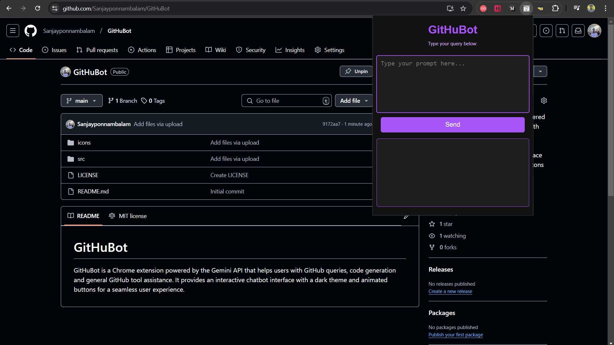
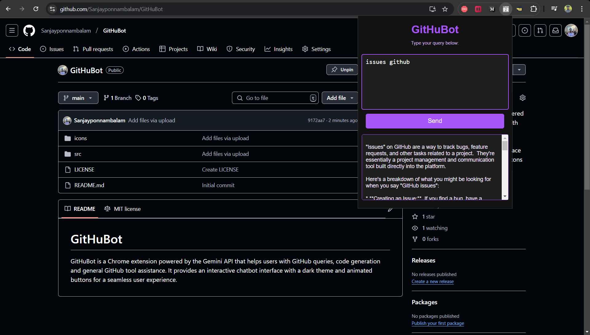

# GitHuBot
GitHuBot is a Chrome extension powered by the Gemini API that helps users with GitHub queries, code generation and general GitHub tool assistance. It provides an interactive chatbot interface with a dark theme and animated buttons for a seamless user experience.

---

## Table of Contents
1. [Features](#features)
2. [Installation](#installation)
3. [Usage](#usage)
4. [API Integration](#api-integration)
5. [Technologies Used](#technologies-used)
6. [Screenshots](#screenshots)
7. [License](#license)


---

## Features
- **Send Prompts**: Type a query in the popup and send it to the Gemini API to get intelligent responses.
- **Attractive UI**: Clean and responsive popup interface with a black and purple theme.
- **Error Handling**: Handles invalid inputs or API response errors smoothly.

---

## Installation
Follow these steps to set up GitHuBot as a Chrome extension:

1. **Clone the Repository**
   ```bash
   git clone https://github.com/Sanjayponnambalam/GitHuBot.git
   cd GitHuBot
   ```

2. **Load the Extension in Chrome**
   - Open Google Chrome and navigate to `chrome://extensions`.
   - Enable **Developer Mode** (toggle at the top right corner).
   - Click **Load unpacked**.
   - Select the project folder where you cloned the repository.

3. **Pin the Extension**
   - Click the Extensions icon in Chrome's toolbar.
   - Pin **GitHuBot** for quick access.

---

## Usage

1. **Enter a Prompt**
   - Click the GitHuBot icon in the Chrome toolbar to open the popup.
   - Type your query in the text area and click **Send** to receive a response.

2. **View Responses**
   - The generated response or explanation will be displayed in the GitHuBot popup.

---

## API Integration
GitHuBot integrates with the **Gemini API** to generate text-based responses and explanations.

- **API Endpoint**:
   ```
   https://generativelanguage.googleapis.com/v1beta/models/gemini-1.5-flash:generateContent
   ```
- **API Key**: Replace `YOUR_API_KEY` in the `background.js` file with your Gemini API key:
   ```javascript
   const API_KEY = "YOUR_API_KEY";
   ```
   
---

## Technologies Used

- **HTML**: Structure of the extension popup.
- **CSS**: Styling the popup with a modern and attractive UI (black and purple theme).
- **JavaScript**: Logic for handling input, API calls, and word explanations.
- **Chrome Extensions API**: To build and integrate the browser extension.
- **Gemini API**: For generating intelligent text-based responses.

---

## Screenshots

### Popup Interface


### Popup Work


---

## License

This project is licensed under the **MIT License**. See the `LICENSE` file for more details.

---

